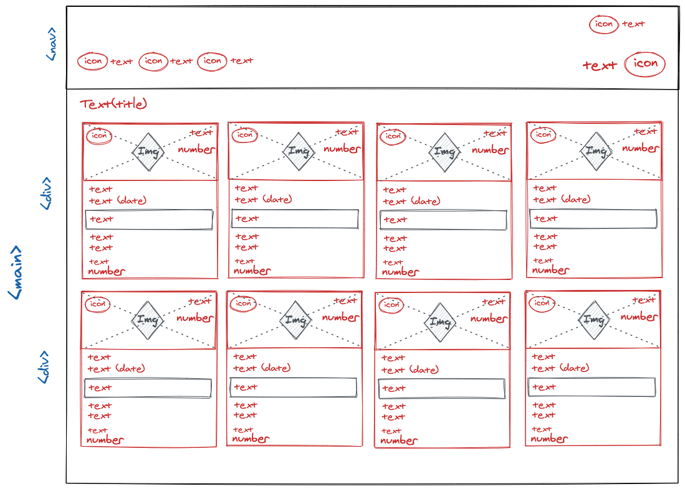
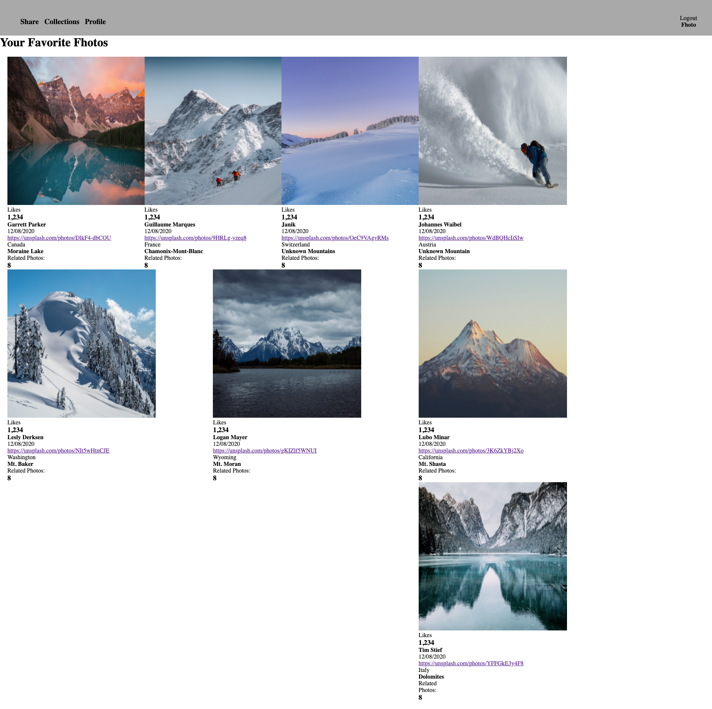

  <a href="https://github.com/alexthompson207/static-comp">
    <!--  -->
  </a>

  <h1 align="center">Static Comp Solo Challenge</h1>

## Table of Contents

- [About the Project](#about-the-project)
- [Functionality](#functionality)
  - [Giph of Game Play](#game-play)
  - [Giph of Game End](#game-end)
- [Set-up Instructions](#set-up-instructions)
- [Contributors](#contributors)
  - [Built With](#built-with)
- [Contact](#contact)

## About The Project

[Deployed Site](https://alexthompson207.github.io/static-comp/)
[Project Brief and Rubric](https://frontend.turing.io/projects/module-1/m1-static-comp)

The goal of this [project](https://alexthompson207.github.io/static-comp/) was to use CSS and HTML to recreate a webpage based off a provided static design. The integrity of the original design was to remain intact, however we were given the creative license for copy, images, icons, and colors. Furthermore, we were required to make our  page compatible across different browsers such as Firefox, Safari, and Chrome and have smooth transitions on our webpage into different breakpoints for desktop, tablet, and mobile views.

#### Built With:

- 

- 

Below is the required layout of the provided comp;
#### Static Comp Website

## Progression

I started this project by creating a public repo on GitHub and adding `index.html`, `styles.css`, and `normailize.css` files, along with an `assets` directory to hold all images and icons I used to build out my comp. 

Next, I made a rough wireframe of the basic layout I wanted to achieve. This helped me to conceptualize the structure of my website and see how HTML tags would relate to certain CSS flexbox strategies. 
See wireframe below.

#### Wireframe

Then I was able to create a basic HTML layout using a `<nav>` tag for the bar across the top and a `<section>` tag for the card layouts. From there I mostly used `
` tags to create containers around elements to style them according. One issue I ran into was the images I found online were all different sizes and both horizontal and vertical views. I initially tried to make this work, but without some Photoshop magic, I resorted to using all images that were in a horizontal orientation. 

#### Draft Using Fixed Image Heights and Widths

After I started to use all horizontal orientation images I no longer needed to use a fixed width and height. Next I began to add fonts, colors, icons, and borders to my website. Then I created 2 media queries for different breakpoints and used relative measurement units in my CSS to make my webpage responsive for all views. Lastly I played with subtle CSS styling such as hovers and cursors. 

#### Final Comp in Desktop View

#### Final Comp in Mobile View

## Author

* [Alex Thompson](https://github.com/alexthompson207)

## Contact

[][linkedin]
[][gmail]
[][github]

<!-- Personal Definitions  -->

[linkedin]: https://www.linkedin.com/in/alex-thompson-309070a2/
[Gmail]: mailto:ahthomps1@gmail.com
[github]: https://github.com/alexthompson207
